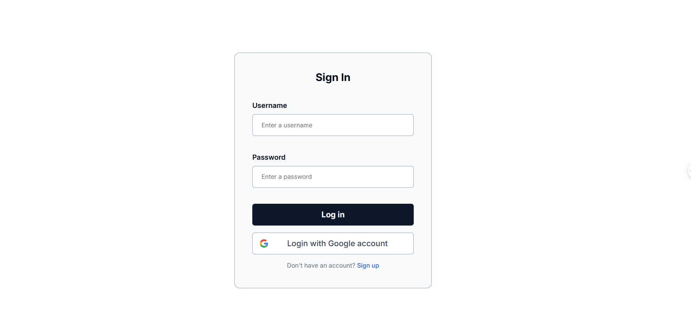

   
    
   

  

    
    
    
    
    
    
    
    
    
    
    
    
    
    
  

   <h1 align="center">OU Social Hub</h1>

## 📋 <a name="table">Table of Contents</a>
1. 🤖 [Introduction](#introduction)
2. ⚙️ [Tech Stack](#tech-stack)
3. 📌 [Features](#features)
4. 📝 [Documentation](#documentation)
5. 🤸 [Quick Start](#quick-start)
6. 🔗 [Reference](#reference)
7. 📦 [Assets](#assets)
8. 🚀 [More](#more)

## <a name="introduction">🤖 Introduction</a>

OU Social Hub is a project aimed at building an online social media platform exclusively for the student community of Ho Chi Minh City Open University. This website focuses on developing a platform to share news, announcements, and events from the university.

## <a name="tech-stack">⚙️ Tech Stack</a>

### 🌐 Frontend
- **React.js**: A JavaScript library for building user interfaces.
- **Next.js**: A React framework for production-level applications with server-side rendering and static site generation.
- **Tailwind CSS**: A utility-first CSS framework for styling applications efficiently.
- **ShadCN UI**: A design system for building beautiful UIs with modern components.
- **TanStack Query (React Query)**: A powerful data-fetching library for managing server state and caching in React applications.

### 🔧 Backend
- **Node.js**: A JavaScript runtime built on Chrome's V8 engine for server-side scripting.
- **Express.js**: A fast and minimalist web framework for Node.js, ideal for building APIs.
- **TypeScript**: A strongly-typed superset of JavaScript that adds static typing to the language.
- **JWT (JSON Web Tokens)**: A standard for securely transmitting information between parties as a JSON object.
- **Prisma**: An ORM (Object-Relational Mapper) that helps with database management and query building.
- **MongoDB**: A NoSQL document-based database for flexible and scalable data storage.
- **Redis**: An in-memory key-value data store, used for caching and real-time data processing.
- **Kafka**: A distributed event streaming platform used for building real-time streaming data pipelines and applications.

### 🛠️ Tools & Services
- **Git**: Version control system for tracking changes in the source code.
- **Docker**: A containerization platform for deploying and running applications in isolated environments.
- **ELK Stack**: (Elasticsearch, Logstash, Kibana) A powerful logging and analytics stack for monitoring and managing logs.
- **Socket.IO**: A real-time communication library for enabling WebSockets in your applications.
- **Uploadthing**: A service for handling file uploads, often used to optimize and store images via URLs.

## <a name="features">📌 Features</a>
